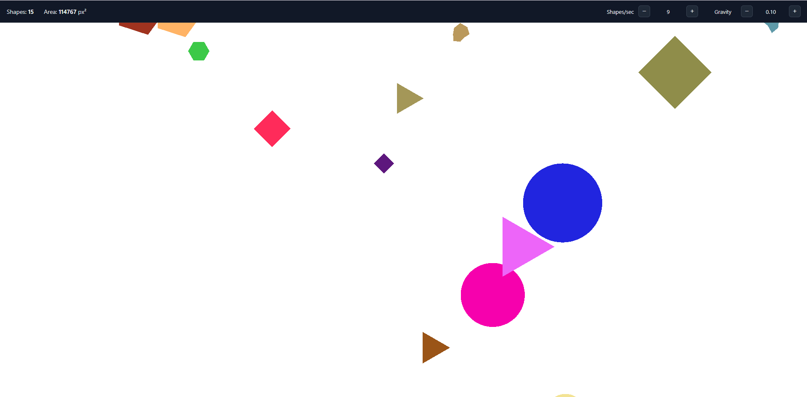

## Getting started

1. Clone the repository

```
git clone https://github.com/Karabinskiy13/pixi-shapes
```

2. Install all dependencies

```
npm install
```

3. Run the project

```
npm run dev
```

4. Open http://localhost:8080/

5. Have fun!



# Pixi Shapes

Test task implemented with PixiJS v8 and TypeScript.
The project demonstrates basic MVC architecture, shape generation and interaction.

## Tech stack

- PixiJS v8
- TypeScript
- SCSS
- Vite